# Excel & Power BI Project: Which Real Estate Assets are of most Interest to Investors in Mumbai?

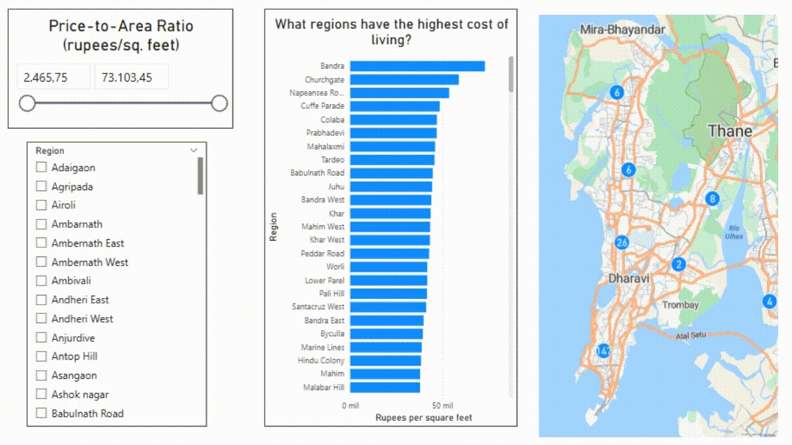

## Introduction

As an investment enthusiast, I have been always interested in real estate. However, I do think that one tends to only focus in their local environtment and not for the opportunities that might come from abroad. As a result, I decided to start this project to try to understand this market in other countries. 

Particularly, this project aims to analyze the housing prices in Mumbai (India) like a real estate investor would do, wanting to know what are the locations of the houses that might generate the highest benefit in the long term. For this purpose, I will use mainly Excel to extract the crucial insights and a bit of Power BI to generate the map charts.

### Crucial questions to analyze

To understand the housing prices in Mumbai, I had to ask to myself the following questions:

1. Where are located the most expensive and most affordable properties?
2. What are the most profitable real state investments?
3. Which type of houses are the most in demand?
4. Does the status of a house affect its price notably?
5. Which regions have the highest living cost?

### Excel Skills Used

The following Excel Skills were used throughout this project:

- Pivot Tables
- Pivot Charts
- Power Query 
- DAX (Data Analysis Expressions)

Additionally, I used Power Query and charts from Power BI to generate the map charts for questions 2. and 5.

### Dashboard Files

You can feel free to use the same files as me here below:

- Excel file: [Mumbai_Housing_Analysis.xlsx](Mumbai_Housing_Analysis.xlsx)
- Power BI file: [Project-Mumbai_Housing.pbix](Project-Mumbai_Housing.pbix)
- CSV Dataset: [mumbai_house_data.csv](mumbai_house_data.csv)

### Mumbai Housing Prices Dataset

The dataset used for this project contains real-world housing prices in Mumbai from June 2025. It comes from [Kaggle](https://www.kaggle.com/datasets/tilakjain/mumbai-house-data?resource=download). Both this project and the dataset are covered by the [MIT license](LICENSE).

Overall, it includes detailed information of a huge number of houses:

- Number of rooms (including halls and bathrooms) and area (in square feet)
- Type (apartment, penthouse,...)
- Locality and region
- Price (in rupees)
- Construction state and age
- Market data: expected ROI, demand, market volatility and liquidity

For more information for each attribute, feel free to consult [here](https://www.kaggle.com/datasets/tilakjain/mumbai-house-data?resource=download)

# Where are located the most expensive and most affordable properties?

## Skill 1: Power Query

Firstly, I used Power Query to extract the original data (`mumbai_house_data.csv`).

### Transformation
Then, I realized that the dataset contained the following two columns:

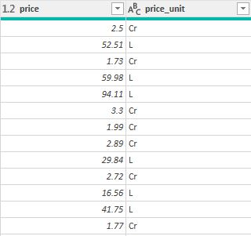

`Cr` stands for *Crore*, which means ten million (10,000,000) in Indian; while `L` stands for *Lakh*, which means one hundred thousand (100,000) in Indian. So I needed to add a conditional column to express the price (in rupees) properly. For this finality, I applied the following code in M language to mutiply by 10,000,000 or 100,000, depending on the case:

```
= Table.AddColumn(#"Changed Variable Types", "price_adjusted", each if [price_unit] = "Cr" then [price]*Number.Power(10, 7) else [price]*Number.Power(10, 5), type number)
```
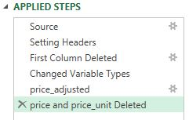

As a result, I obtained a new column, `price_adjusted`, and I was able to delete the previous two columns.

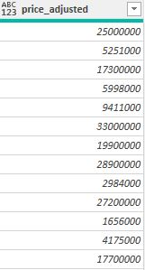

## Skill 2: Pivot Table
Once I loaded the transformed data, I created a pivot table to group it by localities and compute the average price. Subsequently, I filtered the data making a Top 20 and a Bottom 20 of these localities by price.

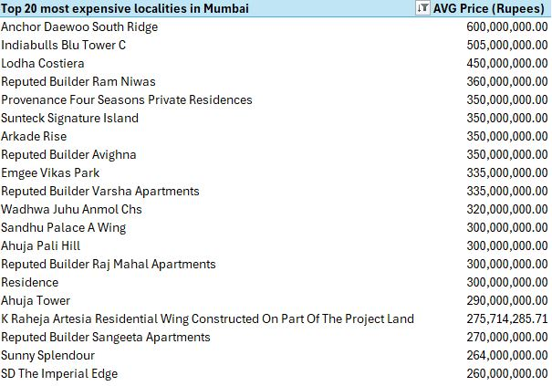

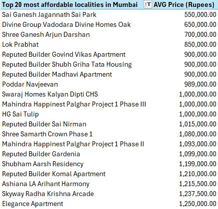

## Skill 3: Power Query and Graphs in Power BI
In order to obtain insights for this data, it was convenient to use the map charts from Power BI. I used the same steps in the Power Query editor of Power BI as in the one of Excel for the `mumbai_house_data.csv`.

### Geographic precision
The first time I wanted to insert map charts, I ended up with this:

It is obvious that there is a lot of points that are really for away from Mumbai.

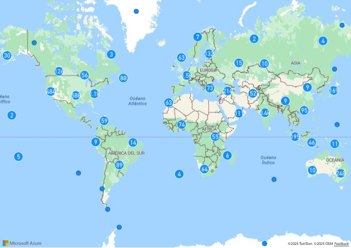

To try to add more precision to the localitions, I added a new column in Power Query which was the union between the column `locality`, `region` and the sufix ", Mumbai, Maharashtra, India". Despite the improvement on the map, I still had nuisances like this one:

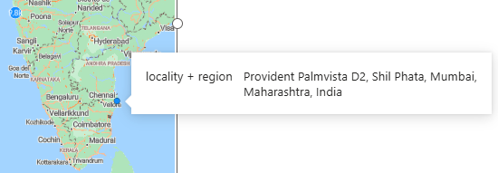

In order to fix it once and for all, I used lattitude and longitude coordinates at the beginning of the localities for all the remaining anomalies. The code of the added column ended up being something like this:

```
= Table.AddColumn(price_adjusted, "locality + region", each if [#"locality"] = "Dipal Shubham Alaska" then "Building No. 28, Shival Nagar, Pant Nagar, Ghatkopar East, Mumbai, Maharashtra, India" else if [#"locality"] = "Kailash Parvat I" then "Plot No.19 & 20, Roadpali, Kalamboli, Sector-17, Navi Mumbai, Maharashtra, India" else if [#"locality"] = "Himanshu Mount View R4 To R7" then "Mount View Complex R4 to R7, Pale Gaon, MIDC Rd, Ambernath, Maharashtra, India" else if [#"locality"] = "Dipal Shubham Alaska" then "Building No. 28, Shival Nagar, Pant Nagar, Ghatkopar East, Mumbai, Maharashtra, India" else if [#"locality"] = "Kailash Parvat I" then "Plot No.19 & 20, Roadpali, Kalamboli, Sector-17, Navi Mumbai, Maharashtra, India" else if [#"locality"] = "Himanshu Mount View R4 To R7" then "Mount View Complex R4 to R7, Pale Gaon, MIDC Rd, Ambernath, Maharashtra, India" else if [#"locality"] = "Provident Palmvista D2" then "19.14, 73.05 Provident Palmvista D2, Shil Phata, Mumbai, Maharashtra, India" else if [#"locality"] = "Gee Cee Aspira 206" then "19.01, 73.11 Gee Cee Aspira 206, Panvel, Mumbai, Maharashtra, India" else if [#"locality"] = "Sai Prasad Residency CHS" then "19.03, 73.07 Sai Prasad Residency CHS, Kharghar, Mumbai, Maharashtra, India" else if [#"locality"] = "Mahavir Garden" then "19.47, 72.79 Mahavir Garden, Virar, Mumbai, Maharashtra, India" else if [#"locality"] = "Satellite Satellite Tower" then "19.17, 72.87 Satellite Tower, Goregaon East, Mumbai, Maharashtra, India" else Text.Combine({[locality], ", ", [region], ", Mumbai, Maharashtra, India"}), type text)
```

I finally added a slicer to filter the locations based on the average price. 

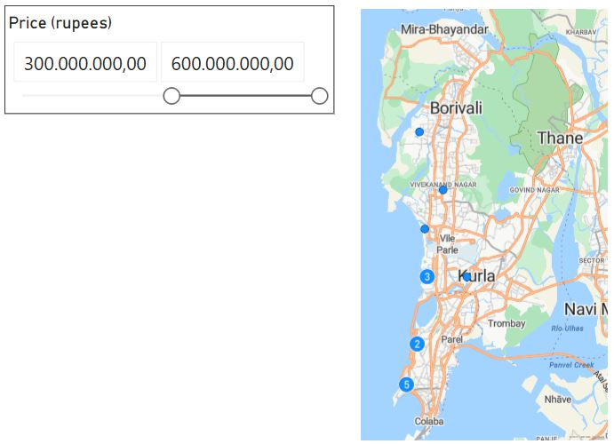

## Analysis

As you can see in the pictures below, the Bottom Region (Mumbai Center) shares both the most affordable and expensive propeties, even though the latters are slightly located in the coast zone. In what concerns the valuable houses, Bandra is the region in Mumbai with the most concentration. On the other hand, their opposites are more scattered among Mumbai, specially in the outskirts of the city.

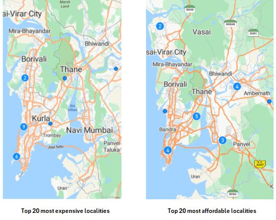

# What are the most profitable real state investments?

## Skill: DAX

To find the "hidden gems" among Mumbai, I took into account two crucial attributes: the expected ROI and the market volatility. A rational real estate investor would prefer the higher the ROI and the lower the volatility, the better. That is the reason why I applied the following measure, which is a variant of the well-known Sharpe Ratio in finances: **ROI/volatility**. The higher it is, the more profitable the asset will be.

To implement that measure, I added the data set to the Data Model, loaded into Power Pivot and typed the following *explicit measure*: 

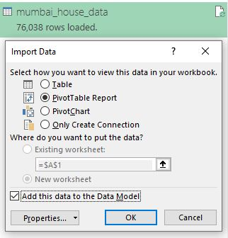

DAX explicit measure: `=DIVIDE([Average of expected_roi(%)]; [Average of market_volatility_score];0)`

## Analysis

Considering the fact that a investor prefers an asset that offers the same profitability with the lowest volatility, I filtered the data for that houses that have a volatility smaller or equal that 2.5 (out of 10, which is the highest possible). As a result, I obtained this list of the most benefitial real state investments:

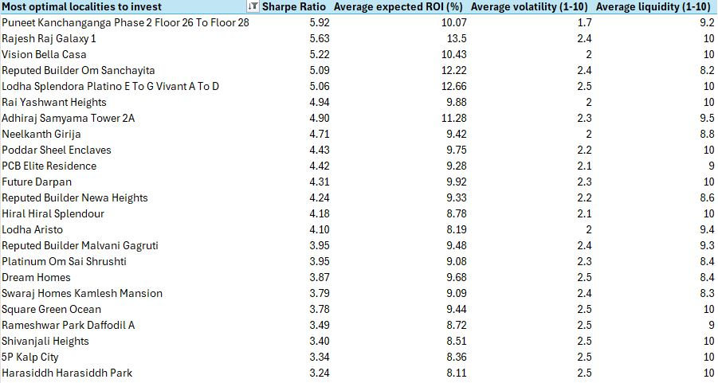

To confirm my decision, I compared the results with their associated liquidity (ease of being sold) and all of them present values higher than 8 (out of 10, which is the highest possible). This means that they are likely to be sold without difficulties in the future.

# Which type of houses are the most in demand?

## Skill: Pivot Table and Pivot Chart

Within the Pivot Table, I used "type" as the Parent Category and number of rooms for the Descendant Category. Finally, I inserted a combined chart to visualize both price and demand and a filter for each of the two previous categories.

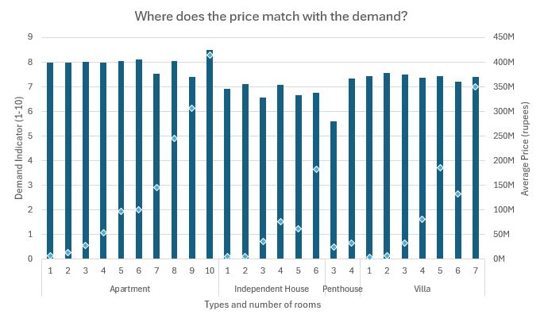

## Analysis

Firstly, it is appreciable the clear exponential correlation between number of rooms and price for each apartament category, as the diamond figures follow somethig similar to an exponential function.

Additionally, despite the uniformity of the data in apartments, the ones which have 10 rooms are most demanded. However, there is a special case for the apartments and independent houses with 5 rooms and the villas with 6 rooms, because they are not only cheaper than their previous number, but they also maintain the same level of demand as the latters.

# Does the status of a house affect its price notably?

## Skill: Pivot Table and Pivot Chart

Similarly to the previous question, I used hierarchies in a Pivot Table, but now with age (new, resale or unknown) as the Parent Category and status (ready to move or under construction) as the Descendant Category. Analogously, I inserted a bar chart to visualize both price and demand. It is important to mention that I did not included the ages of houses which are `unknown` in order to not interfere with the analysis.

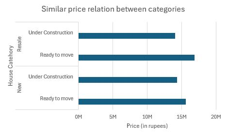

## Analysis

On the one hand, although it might not be noticeable due to the size of the bars, the demand for each category is practically the same. On the other hand, the most valuable properties are to resale and with the construction process finished. However, this fact does not detriment the other categories of houses, as they are not so uneven in price.

# Which regions have the highest living cost?

## Skill 1: Power Pivot

To calculate the price in rupees of a square feet of a property in each region, I type the following explicit measure, which involves the price and the area of a house, in DAX:

`=DIVIDE([Average of price_adjusted];[Average of area];0)`

## Skill 2: Power Query and Graphs in Power BI

In order to obtain insights for this data, it was convenient to use the map charts from Power BI. Firstly, I imported the worksheet I was using Excel to answer the question of this section, which consisted of the columns `Region`, `Price-to-area Ratio (rupees)`, `AVG Price (rupees)` and `AVG area (sq. ft.)`. Secondly, I added for each `Region` the sufix ", Mumbai, Maharashtra, India"

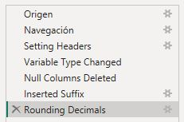

Finally, I inserted a map and bar chart and slicers to filter depending on the average price and the region of interest.

## Analysis

Approximately, the 8% of the regions in Mumbai have a price above the 40,000 rupees per square feet. What's more, the Top 3 is above 50,000 rupees and the Top 1 (Bandra) exceeds the amount of 70,000. 

Filtering via Power BI the amount of the price per square feet above the 40,000 rupees, one obtains the following locations in the map chart:

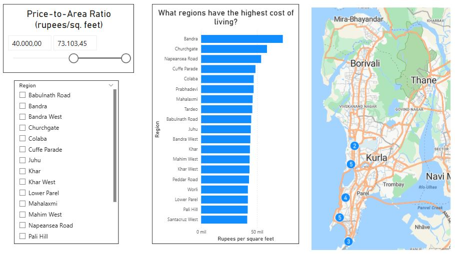

Now it is more notable that this 8% of regions are located in the coast of Mumbai, which also matches with the locations of the most expensive properties.

# Conclusion

As a data an finance enthusiast, I embarked on this mainly Excel-based project to uncover valuable insights of real estate internationally. Using a dataset I have curated from real-world house pricing in Mumbai, I analyzed number of rooms, price, type, locations and market data.

By leveraging Excel (and Power BI) features like Power Query, Pivot Tables, DAX and charts, I discovered the locations of the most affordable and expensive houses, the most profitable for investments, demand and price based on house types and status and the living cost of different regions.

Finally, I hope this project serves as a practical guide for real estate investors wanting to operate in Mumbai and provides an overview of the key insights in that market.
